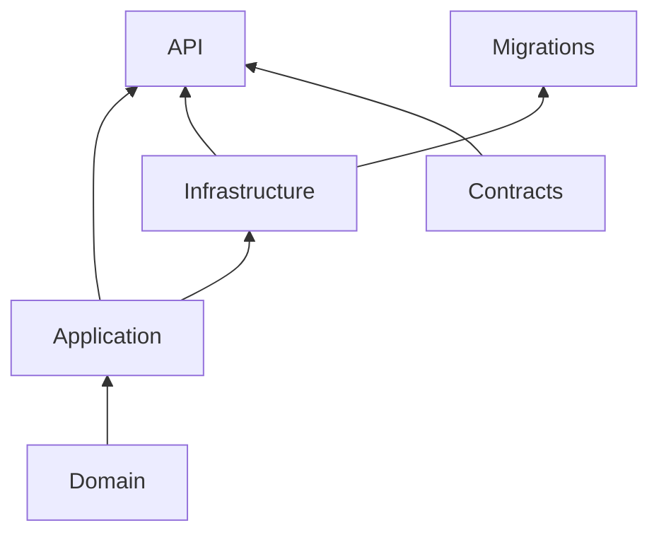

# Dependências entre Camadas

Diagrama indica direção de referências de projeto, não toda dependência de runtime.

- Domain permanece independente, sem EF/Dapper/HTTP/Infrastructure.
- Application depende de Domain e declara ports/contratos de casos de uso.
- Infrastructure implementa ports, usa banco/fornecedores; depende de Application e Domain.
- API é composition root e referencia Application, Infrastructure e Contracts.
- Contracts define contratos externos sem entidades do domínio.
- Migrations é executável separado que referencia Infrastructure.

Confirmado por `.csproj`, `openspec/conventions.md`, `AGENTS.md` e testes `tests/OrderHub.Architecture.Tests/`. Na Web, router → layout → módulos → clients/stores locais → HTTP; autorização, cálculo e regras autoritativas continuam API/Domain. Pastas globais `composables/services/stores/models` só têm `.gitkeep`, portanto sua função futura é **Não identificada no repositório**.

Ver [[03 - API/Camadas da API|Camadas da API]], [[04 - WEB/Estrutura Frontend|Estrutura Frontend]].

