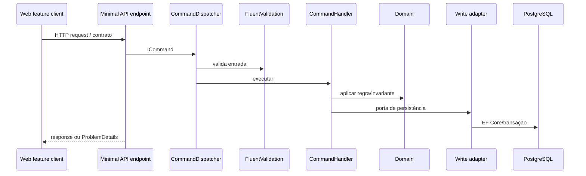

# Fluxo de uma Requisição

## Escrita

## Leitura

Web → endpoint → `IQueryDispatcher` → validação quando necessária → QueryHandler → read gateway → Dapper → PostgreSQL → DTO/read model.

Endpoints observados em `src/OrderHub.Api/*/*Endpoints.cs` são Minimal APIs. `src/OrderHub.Application/Dispatching/` contém dispatchers próprios; endpoints encaminham caso de uso, sem carregar regra de negócio. Contracts converte borda; Domain não vaza para HTTP.

Pedido público: API resolve unidade, preços, disponibilidade, entrega/cupom/slots; Domain calcula e protege transições; confirmação usa idempotency key. Ver [[Fluxo de Pedido]], [[Endpoints de Pedido]].

