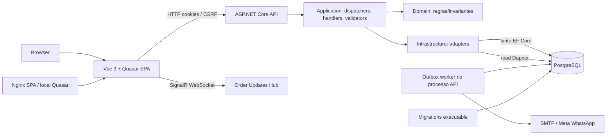

# Mapa de Componentes

**Documentado:** monólito modular; sem broker externo; Outbox/worker local no monólito. **Implementado/configurado:** Compose contém `postgres`, `mailpit`, `migrations`, `api`, `web`; `Program.cs` registra SignalR e serviços; Nginx encaminha `/hubs/`. Fontes `docker-compose.yml`, `docker/web/nginx.conf`, `src/OrderHub.Infrastructure.Migrations/Program.cs`.

Ver [[03 - API/Infraestrutura|Infraestrutura]], [[04 - WEB/Comunicação com a API|Comunicação com a API]], [[ADR-003 - Transactional Outbox]].

