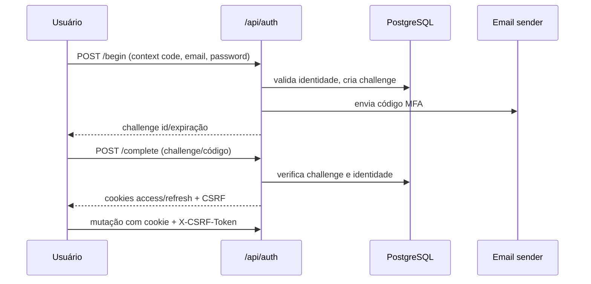

# Autenticação e Autorização

`AuthenticationEndpoints.cs`: `/context`, `/begin`, `/complete`, `/refresh`, `/logout`, `/change-password`, gestão de platform users. `oh_access` e `oh_refresh` HttpOnly/SameSite Strict; `oh_csrf` legível pelo JS e enviado no header. Refresh valida header/cookie. `AuthenticationSecurityMiddleware` exige CSRF em mutações autenticadas e limita sessão que deve trocar senha.

`SessionAuthenticationHandler` resolve sessão persistida e cria claims. `HttpTenantContext` lê Tenant/user da principal; Tenant ausente em caso tenant-scoped falha fechado. `AdministrativePolicies.RoleMap` associa capabilities e papéis; router guard não substitui autorização API.

Specs: `openspec/specs/identity/administrative-authentication/spec.md`, `administrative-users/spec.md`; ADR-002. Código `src/OrderHub.Api/Authentication/`, `Middleware/AuthenticationSecurityMiddleware.cs`, `Tenancy/HttpTenantContext.cs`, `src/OrderHub.Application/Identity/AdministrativePolicies.cs`. Ver [[Usuário Administrativo]], [[Multi-tenancy]].

