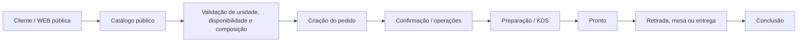

# Fluxo de Pedido

É um resumo do modelo e dos módulos, não garantia de todas as transições disponíveis em cada canal. Status e regras em `Order.cs` (que declara `OrderItem`, o enum `OrderStatus` e os tipos de serviço), spec `openspec/specs/ordering/order-management/spec.md`. Agendamento: `order-scheduling`; notificação/outbox tem specs próprias. Relacionado: [[Pedido]], [[Regras de Pedido]], [[Endpoints de Pedido]], [[Telas de Pedido]], [[Disponibilidade]], [[Pagamento]].

